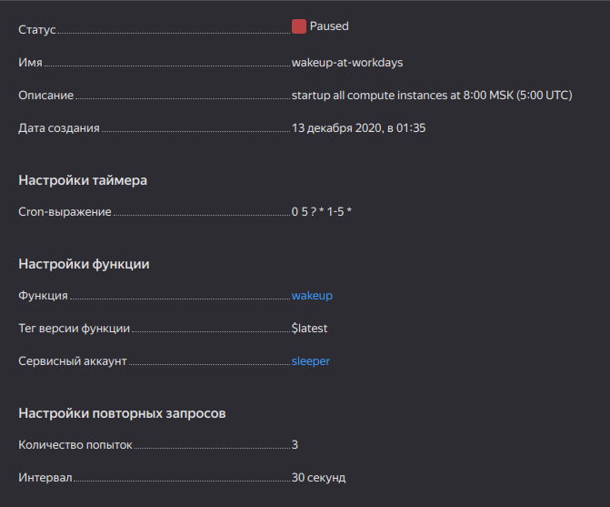

# Simple serverless Go cloud function for wakeup compute instances

Wakeup stopped compute instances in Yandex Cloud (usually spot instances). \
You need to have service account and create trigger (as cron job) to launch this function periodically. \
Tune `folderID` in `wakeup.go` variable with your Folder ID value in Yandex Cloud where compute instances works.\
Also `sleep.go` is used to stop running instances (e.g. at weekend period).

## Trigger example

## Links

- [Yandex Cloud SDK for Go](https://cloud.yandex.ru/docs/functions/lang/golang/sdk)
